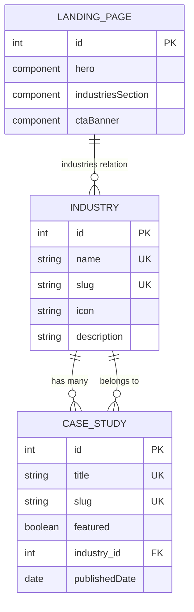

# Data Model: ADC Homepage

**Feature**: `homepage-r1`  
**Plan Reference**: `.specify/memory/plan-homepage.md`

---

## Entities

### Landing Page (Single Type)

**API ID**: `api::landing-page.landing-page`  
**Description**: Homepage content container with dynamic sections

```typescript
interface LandingPage {
  id: number;
  documentId: string;
  hero: HeroComponent;
  industriesSection: IndustriesSectionComponent;
  featuredCasesSection: FeaturedCasesSectionComponent;
  ctaBanner: CtaBannerComponent;
  seo: SeoComponent;
  createdAt: string;
  updatedAt: string;
  publishedAt: string;
}

interface HeroComponent {
  id: number;
  heading: string;          // max 80 chars, required
  description: string;      // max 200 chars, optional
  primaryCta: CtaLink;
  secondaryCta: CtaLink;
  backgroundImage: Media;   // single image
}

interface IndustriesSectionComponent {
  id: number;
  heading: string;
  description: string;      // optional
  industries: Industry[];   // relation to Industry collection
}

interface FeaturedCasesSectionComponent {
  id: number;
  heading: string;
  description: string;      // optional
  // Cases fetched via featured filter, not direct relation
}

interface CtaBannerComponent {
  id: number;
  heading: string;
  description: string;
  primaryCta: CtaLink;
  secondaryCta: CtaLink;    // optional
  backgroundType: 'gradient' | 'image' | 'pattern';
}

interface CtaLink {
  label: string;
  url: string;
  type: 'internal' | 'external';
}

interface SeoComponent {
  metaTitle: string;
  metaDescription: string;
  metaImage: Media;
  keywords: string;
  canonicalUrl: string;
}
```

**Validation Rules**:
- `hero.heading`: Required, 1-80 characters
- `hero.description`: Optional, max 200 characters
- `ctaBanner.primaryCta`: Required
- `seo.metaDescription`: 150-160 characters recommended

---

### Industry (Collection Type)

**API ID**: `api::industry.industry`  
**Description**: Vertical market sectors served by ADC

```typescript
interface Industry {
  id: number;
  documentId: string;
  name: string;             // e.g., "Financial Services"
  slug: string;             // e.g., "financial-services", unique
  icon: string;             // Lucide icon name or SVG path
  description: string;      // Short description for card
  fullDescription: string;  // For dedicated industry page (Phase 2)
  caseStudies: CaseStudy[]; // relation (hasMany)
  createdAt: string;
  updatedAt: string;
  publishedAt: string;
}
```

**Validation Rules**:
- `name`: Required, unique, 3-50 characters
- `slug`: Required, unique, auto-generated from name
- `icon`: Required, valid Lucide icon name
- `description`: Required, max 150 characters

**Sample Data**:
```json
[
  { "name": "Financial Services", "slug": "financial-services", "icon": "building-2", "description": "Transform banking and fintech with AI-powered insights" },
  { "name": "Retail & E-commerce", "slug": "retail", "icon": "shopping-cart", "description": "Optimize customer experience with predictive analytics" },
  { "name": "Energy & Utilities", "slug": "energy", "icon": "zap", "description": "Smart grid optimization and sustainability analytics" }
]
```

---

### Case Study (Collection Type)

**API ID**: `api::case-study.case-study`  
**Description**: Client success stories and project showcases

```typescript
interface CaseStudy {
  id: number;
  documentId: string;
  title: string;                    // e.g., "Real-time Fraud Detection for ABN AMRO"
  slug: string;                     // URL-friendly unique identifier
  summary: string;                  // Short description for grid card
  content: string;                  // Full case study content (rich text)
  featured: boolean;                // Show on homepage if true
  featuredImage: Media;             // Hero image
  industry: Industry;               // relation (belongsTo)
  client: string;                   // Client name (optional)
  publishedDate: string;            // Date format: YYYY-MM-DD
  tags: Tag[];                      // relation (optional, Phase 2)
  results: ResultComponent[];       // Key metrics/outcomes
  createdAt: string;
  updatedAt: string;
  publishedAt: string;
}

interface ResultComponent {
  id: number;
  metric: string;                   // e.g., "90% Reduction"
  description: string;              // e.g., "in false positives"
}
```

**Validation Rules**:
- `title`: Required, unique, 10-100 characters
- `slug`: Required, unique, auto-generated from title
- `summary`: Required, 50-200 characters
- `content`: Required, min 500 characters
- `featured`: Boolean, default false
- `featuredImage`: Required
- `industry`: Required relation
- `publishedDate`: Required, date format

**Sample Data**:
```json
[
  {
    "title": "AI-Powered Customer Insights for Retail Leader",
    "slug": "retail-customer-insights",
    "summary": "Increased conversion rates by 35% using predictive analytics and personalization",
    "featured": true,
    "industry": "retail",
    "publishedDate": "2024-10-15"
  }
]
```

---

## Relationships



---

## State Transitions

### Landing Page
- Draft → Published (Strapi admin approval)
- Published → Draft (Unpublish for edits)

### Case Study
- Draft → Published (Ready for homepage display)
- Published → Draft (Remove from homepage temporarily)
- `featured` flag: Toggle on/off independently of publish state

---

## Database Indexes

**Recommended for performance**:

```sql
-- Case Study
CREATE INDEX idx_case_study_featured ON case_studies(featured, published_at);
CREATE INDEX idx_case_study_industry ON case_studies(industry_id);
CREATE INDEX idx_case_study_slug ON case_studies(slug);

-- Industry
CREATE INDEX idx_industry_slug ON industries(slug);
```

---

## Migration Notes

### Existing Content Types
- `article` (exists) - Not used in homepage R1, keep for Phase 2
- `author` (exists) - Not used in homepage R1, keep for blog
- `tag` (exists) - Not used in homepage R1, add relation to Case Study in Phase 2

### New Content Types (Priority Order)
1. **Industry** - Create first (no dependencies)
2. **Case Study** - Create second (depends on Industry)
3. **Landing Page** - Create last (depends on Industry for relation)

---

**Status**: Data model complete  
**Next**: Generate API contracts in `.specify/contracts/homepage-api.yaml`
