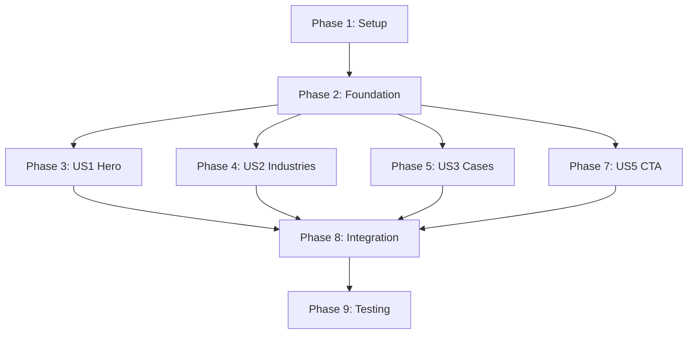

# Tasks: ADC Homepage Implementation

**Feature**: `homepage-r1`  
**Spec**: `.specify/memory/spec-homepage.md`  
**Plan**: `.specify/memory/plan-homepage.md`  
**Data Model**: `.specify/memory/data-model-homepage.md`  
**API Contracts**: `.specify/contracts/homepage-api.yaml`

---

## Overview

This document breaks down the ADC homepage feature into executable tasks organized by user story.Each task follows the Speckit format with unique IDs, parallelization markers, and file paths.

**Total Tasks**: 32  
**User Stories**: 5 (FR-1 through FR-5)  
**Estimated Timeline**: 8 days

---

## Phase 1: Setup & Prerequisites

**Goal**: Initialize project foundation and verify environment

### Tasks

- [ ] T001 Verify Node.js v22 is active via nvm
- [ ] T002 Verify both servers running (Strapi :1337, React Router :5174)
- [ ] T003 [P] Copy Ease font files to client/public/fonts/ directory
- [ ] T004 [P] Verify design tokens configured in client/app/app.css
- [ ] T005 [P] Verify shadcn/ui components installed (carousel, dialog, input, form)

---

## Phase 2: Foundational Infrastructure

**Goal**: Create Strapi content types that all user stories depend on

### Tasks

- [ ] T006 Create Industry collection type in server/src/api/industry/content-types/industry/schema.json
- [ ] T007 Create CaseStudy collection type in server/src/api/case-study/content-types/case-study/schema.json
- [ ] T008 Update LandingPage single type in server/src/api/landing-page/content-types/landing-page/schema.json
- [ ] T009 Seed 5 sample industries via Strapi admin panel
- [ ] T010 Seed 3 sample case studies with featured=true via Strapi admin panel
- [ ] T011 Update Strapi API client in client/app/lib/strapi.ts with type-safe fetch functions

**Dependencies**: T006-T008 must complete before T009-T010 (content types before seeding)

---

## Phase 3: User Story 1 - Hero Section (FR-1)

**Goal**: Implement above-the-fold hero with heading, CTAs, and background image  
**Priority**: P0  
**Independent Test**: Hero displays with editable content from Strapi, both CTAs clickable

### Tasks

- [ ] T012 [P] [US1] Create Hero component in client/app/components/blocks/Hero.tsx
- [ ] T013 [P] [US1] Add Hero TypeScript interfaces in client/app/types/landing-page.ts
- [ ] T014 [US1] Integrate Hero component into homepage route client/app/routes/_index.tsx
- [ ] T015 [US1] Test Hero component rendering with mock data
- [ ] T016 [US1] Update LandingPage schema to include hero component structure
- [ ] T017 [US1] Populate hero content in Strapi admin panel
- [ ] T018 [US1] Verify Hero loads data from Strapi API via route loader

**Acceptance**: Hero section visible on homepage with Strapi content, responsive on mobile/desktop

---

## Phase 4: User Story 2 - Industries Section (FR-2)

**Goal**: Showcase ADC's vertical expertise with carousel/grid layout  
**Priority**: P0  
**Independent Test**: Industries display in carousel on mobile, grid on desktop, clicking navigates to industry page

### Tasks

- [ ] T019 [P] [US2] Install embla-carousel-react via yarn in client/ directory
- [ ] T020 [P] [US2] Create IndustryCard component in client/app/components/blocks/IndustryCard.tsx
- [ ] T021 [P] [US2] Create IndustryCarousel component (mobile) in client/app/components/blocks/IndustryCarousel.tsx
- [ ] T022 [P] [US2] Create IndustryGrid component (desktop) in client/app/components/blocks/IndustryGrid.tsx
- [ ] T023 [US2] Add responsive switching logic for carousel/grid in client/app/components/blocks/IndustriesSection.tsx
- [ ] T024 [US2] Integrate IndustriesSection into homepage route client/app/routes/_index.tsx
- [ ] T025 [US2] Update route loader to fetch industries data from Strapi
- [ ] T026 [US2] Test carousel navigation and grid layout responsiveness

**Acceptance**: Industries section displays with carousel on mobile (<768px), grid on desktop (≥1024px)

---

## Phase 5: User Story 3 - Featured Cases Section (FR-3)

**Goal**: Display 3 featured case study cards with images, titles, and industry tags  
**Priority**: P0  
**Independent Test**: Featured cases load and display correctly, clicking card navigates to case detail page

### Tasks

- [ ] T027 [P] [US3] Create CaseCard component in client/app/components/blocks/CaseCard.tsx
- [ ] T028 [P] [US3] Create FeaturedCases section component in client/app/components/blocks/FeaturedCases.tsx
- [ ] T029 [US3] Integrate FeaturedCases into homepage route client/app/routes/_index.tsx
- [ ] T030 [US3] Update route loader to fetch featured=true case studies from Strapi
- [ ] T031 [US3] Implement image lazy loading for case featured images
- [ ] T032 [US3] Test case card click navigation and responsive grid layout

**Acceptance**: 3 featured case studies displayed in grid, images optimized, cards link correctly

---

## Phase 6: User Story 4 - Insights Preview (FR-4)

**Goal**: Show 3 latest blog posts with thumbnails (optional for R1)  
**Priority**: P1 (Deferred to Phase 2)  
**Note**: Marked optional in spec, can be implemented after R1 launch

### Tasks

_(Deferred - Not in MVP scope)_

---

## Phase 7: User Story 5 - CTA Banner (FR-5)

**Goal**: Bottom conversion banner with compelling message and primary CTA  
**Priority**: P0  
**Independent Test**: CTA banner displays with editable content, button navigates to contact page

### Tasks

- [ ] T033 [P] [US5] Create CtaBanner component in client/app/components/blocks/CtaBanner.tsx
- [ ] T034 [US5] Integrate CtaBanner into homepage route client/app/routes/_index.tsx
- [ ] T035 [US5] Update LandingPage schema to include ctaBanner component
- [ ] T036 [US5] Populate CTA banner content in Strapi admin panel
- [ ] T037 [US5] Test CTA button navigation and background styling

**Acceptance**: CTA banner visible at bottom of page, button links to contact page, gradient/pattern background

---

## Phase 8: Integration & Polish

**Goal**: Connect all sections, add error handling, optimize performance

### Tasks

- [ ] T038 [P] Create error boundary component in client/app/components/ErrorBoundary.tsx
- [ ] T039 [P] Create loading skeleton components for each section
- [ ] T040 Implement route loader with error handling in client/app/routes/_index.tsx
- [ ] T041 Add React Router error boundary to homepage route
- [ ] T042 [P] Optimize images: Convert to WebP format, add lazy loading
- [ ] T043 [P] Implement code splitting for carousel library
- [ ] T044 Test full homepage flow: All sections load correctly with real Strapi data
- [ ] T045 Test error scenarios: Strapi unreachable, missing content, invalid data

**Acceptance**: Homepage loads completely, handles errors gracefully, performance optimized

---

## Phase 9: Testing & Quality Assurance

**Goal**: Validate functionality, accessibility, and performance

### Tasks

- [ ] T046 [P] Create E2E test for homepage load in client/tests/e2e/homepage.spec.ts
- [ ] T047 [P] Create E2E test for hero CTAs click navigation
- [ ] T048 [P] Create E2E test for industry carousel/grid functionality
- [ ] T049 [P] Create E2E test for case study card navigation
- [ ] T050 [P] Create E2E test for CTA banner button click
- [ ] T051 [P] Create accessibility audit test in client/tests/accessibility/homepage-a11y.spec.ts
- [ ] T052 Run Lighthouse audit and verify score ≥ 90
- [ ] T053 Verify Core Web Vitals: LCP ≤2.5s, FID ≤100ms, CLS ≤0.1
- [ ] T054 Cross-browser testing: Chrome, Firefox, Safari, Edge
- [ ] T055 Mobile device testing: iOS Safari, Android Chrome

**Acceptance**: All tests passing, Lighthouse ≥90, zero accessibility violations, responsive on all devices

---

## Dependency Graph

**Critical Path**: Setup → Foundation → (Any User Story) → Integration → Testing  
**Parallel Opportunities**: US1, US2, US3, US5 can be developed simultaneously after Foundation phase

---

## Parallel Execution Examples

### Sprint 1 (Foundation)
- **Developer 1**: T006-T008 (Create Strapi schemas)
- **Developer 2**: T003-T005 (Verify frontend setup)
- **Designer**: Prepare font files and final designs

### Sprint 2 (User Stories)
- **Developer 1**: T012-T018 (Hero - US1)
- **Developer 2**: T033-T037 (CTA Banner - US5)
- **Developer 3**: T019-T026 (Industries - US2)

### Sprint 3 (Integration)
- **Developer 1**: T027-T032 (Cases - US3)
- **Developer 2**: T038-T043 (Error handling & optimization)
- **Developer 3**: T046-T051 (E2E tests)

---

## Implementation Strategy

### MVP Scope (Must-Have for R1)
- ✅ US1: Hero Section
- ✅ US2: Industries Section
- ✅ US3: Featured Cases
- ✅ US5: CTA Banner
- ✅ Integration & Testing

### Phase 2 (Post-Launch)
- ⏳ US4: Insights Preview
- ⏳ Advanced animations
- ⏳ Multilingual support

### Success Criteria
- [ ] All MVP user stories implemented and tested
- [ ] Lighthouse score ≥ 90
- [ ] Zero accessibility violations (WCAG 2.1 AA)
- [ ] Core Web Vitals in "Good" range
- [ ] Sabrina (ADC) approval

---

## Task Execution Notes

**For each task**:
1. Create feature branch: `git checkout -b homepage/T###-description`
2. Implement task following file path specified
3. Run relevant tests (unit/integration/E2E)
4. Commit with task ID: `git commit -m "[T###] Description"`
5. Push and create PR: `git push origin homepage/T###-description`
6. Mark task complete after PR merge

**Blockers**:
- Font files not provided → Use system font fallbacks
- Figma designs incomplete → Follow CF brand guidelines
- Strapi API slow → Implement caching layer

---

**Status**: Ready for Implementation  
**Next**: Create GitHub issues via `/speckit.taskstoissues`
