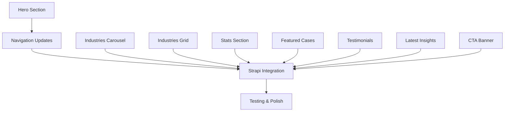

# Tasks: Homepage Sections Implementation

**Epic**: Homepage Redesign  
**Sprint**: Phase 1 - Core Sections  
**Created**: 2025-11-19

---

## Overview

Implement all homepage sections based on Figma designs with Strapi CMS integration. Each section must be responsive and editable via Strapi blocks.

**Figma References**:
- Desktop Design: https://www.figma.com/design/gZY1nFxYgtLNHedrsGbhjQ/ADC-NEW---Design-System---Internal?node-id=26528-7176
- Mobile Design: https://www.figma.com/design/gZY1nFxYgtLNHedrsGbhjQ/ADC-NEW---Design-System---Internal?node-id=26528-7925

---

## Task Breakdown

### TASK-1: Hero Section Component ⭐
**Priority**: P0  
**Estimate**: 8 story points  
**Figma Node IDs**: Desktop (26528:7179) | Mobile (26528:7928)

**Description**:
Implement hero section with special navigation requirements:
- **Desktop**: Navbar shows ONLY logo, menu items appear BELOW hero title
- **Mobile**: Standard hamburger menu with full navigation

**Subtasks**:
- [ ] Create Strapi component `blocks.hero` with fields:
  - `title` (RichText)
  - `subtitle` (Text, optional)
  - `menuItems` (Repeatable component: label, url, icon)
  - `ctaButtons` (Repeatable component: label, url, variant)
- [ ] Create React component `Hero.tsx` with desktop/mobile variants
- [ ] Implement desktop navigation logic (hide nav items, show under title)
- [ ] Implement mobile navigation (hamburger menu)
- [ ] Style with Tailwind matching Figma specs
- [ ] Test responsive breakpoints

**Acceptance Criteria**:
- Desktop: Logo-only navbar, menu items below title
- Mobile: Hamburger menu with full nav
- All content editable in Strapi
- Responsive design matches Figma

---

### TASK-2: Industries Carousel
**Priority**: P1  
**Estimate**: 3 story points  
**Figma Node IDs**: Desktop (26528:7657) | Mobile (26528:8044)

**Description**:
Horizontal scrollable carousel of industry tags/categories.

**Subtasks**:
- [ ] Create Strapi component `blocks.industries-carousel`
  - `items` (Repeatable: label, icon/image optional)
- [ ] Create React component with horizontal scroll
- [ ] Add scroll indicators/arrows
- [ ] Make touch-friendly for mobile
- [ ] Style pills/tags matching Figma

**Acceptance Criteria**:
- Smooth horizontal scrolling
- Touch gestures work on mobile
- Tags editable in Strapi
- Visual design matches Figma

---

### TASK-3: Industries Grid Section
**Priority**: P1  
**Estimate**: 5 story points  
**Figma Node IDs**: Desktop (26528:7665) | Mobile (26528:8052)

**Description**:
Section with title, description, CTA, and 6 industry cards in responsive grid.

**Subtasks**:
- [ ] Create Strapi component `blocks.industries-grid`
  - `title` (Text)
  - `description` (Text)
  - `ctaButton` (Component: label, url)
  - `cards` (Repeatable component: title, description, icon, link)
- [ ] Create React component with responsive grid
  - Desktop: 3x2 grid
  - Mobile: Stacked layout
- [ ] Implement card hover states
- [ ] Style matching Figma

**Acceptance Criteria**:
- 3x2 grid on desktop, stacked on mobile
- All content editable in Strapi
- Hover effects implemented
- Matches Figma design

---

### TASK-4: Build Together Section (Stats)
**Priority**: P1  
**Estimate**: 4 story points  
**Figma Node IDs**: Desktop (26528:7683) | Mobile (26528:8070)

**Description**:
Section showcasing company stats (400+ projects, 178 team members, 3 countries) with decorative background.

**Subtasks**:
- [ ] Create Strapi component `blocks.stats-section`
  - `title` (RichText)
  - `description` (Text)
  - `stats` (Repeatable: number, label, suffix)
  - `ctaButton` (Component)
  - `backgroundImage` (Media, optional)
- [ ] Create React component with stat cards
- [ ] Add number animations (count-up effect)
- [ ] Implement background styling
- [ ] Make responsive

**Acceptance Criteria**:
- 3 stat cards displayed prominently
- Optional count-up animation on scroll
- Background image/pattern from Figma
- All content editable in Strapi

---

### TASK-5: Featured Cases Section
**Priority**: P1  
**Estimate**: 6 story points  
**Figma Node IDs**: Desktop (26528:7704) | Mobile (26528:8091)

**Description**:
Horizontal carousel displaying featured case studies.

**Subtasks**:
- [ ] Create Strapi component `blocks.featured-cases`
  - `title` (Text)
  - `description` (Text)
  - `ctaButton` (Component)
  - `cases` (Relation to Article/Case content type)
- [ ] Create React carousel component
- [ ] Add navigation arrows and indicators
- [ ] Implement auto-scroll (optional)
- [ ] Link to case detail pages
- [ ] Style cards matching Figma

**Acceptance Criteria**:
- Horizontal scrollable carousel
- Cards link to actual case content
- Responsive on mobile
- Matches Figma design

---

### TASK-6: Testimonial/Quote Section
**Priority**: P2  
**Estimate**: 4 story points  
**Figma Node IDs**: Desktop (26528:7895) | Mobile (26528:8109)

**Description**:
Carousel section with client testimonials including quote, author, role, and image.

**Subtasks**:
- [ ] Create Strapi component `blocks.testimonial-carousel`
  - `testimonials` (Repeatable component)
    - `quote` (Text)
    - `authorName` (Text)
    - `authorRole` (Text)
    - `authorCompany` (Text)
    - `industryTag` (Text)
    - `image` (Media, optional)
- [ ] Create React carousel component
- [ ] Add prev/next navigation
- [ ] Implement auto-rotation
- [ ] Style matching Figma (large quotes, etc)

**Acceptance Criteria**:
- Carousel with prev/next controls
- Auto-rotation enabled
- All testimonials editable in Strapi
- Responsive design

---

### TASK-7: Latest Insights Section
**Priority**: P1  
**Estimate**: 5 story points  
**Figma Node IDs**: Desktop (26528:7895) | Mobile (26528:8121)

**Description**:
Section displaying 3 latest blog articles/insights.

**Subtasks**:
- [ ] Create Strapi component `blocks.latest-insights`
  - `title` (Text)
  - `description` (Text)
  - `ctaButton` (Component)
  - `articles` (Relation to Article content type, limit 3)
- [ ] Create React component with article cards
- [ ] Fetch latest articles dynamically
- [ ] Add article preview (image, title, excerpt, date)
- [ ] Link to article detail pages
- [ ] Make responsive (3 cols → stacked)

**Acceptance Criteria**:
- Shows 3 latest articles
- Links to full articles
- Article cards match Figma
- Responsive layout

---

### TASK-8: CTA Banner Section
**Priority**: P1  
**Estimate**: 2 story points  
**Figma Node IDs**: Desktop (26528:7919) | Mobile (26528:8228)

**Description**:
Centered call-to-action banner with title, description, and prominent CTA button.

**Subtasks**:
- [ ] Create Strapi component `blocks.cta-banner`
  - `title` (RichText)
  - `description` (Text)
  - `ctaButton` (Component: label, url, variant)
  - `backgroundColor` (Enumeration: default, primary, secondary)
- [ ] Create React component
- [ ] Center-align content
- [ ] Style with prominent button
- [ ] Make responsive

**Acceptance Criteria**:
- Centered layout
- Prominent CTA button
- Background color customizable
- Fully editable in Strapi

---

### TASK-9: Navigation Component Updates
**Priority**: P0  
**Estimate**: 5 story points  

**Description**:
Update Navigation component to support Hero section requirements.

**Subtasks**:
- [ ] Add prop to Navigation: `hideMenuItems` (boolean)
- [ ] Create `HeroMenuItems` component for desktop
- [ ] Update `DesktopNav.tsx` to conditionally hide menu
- [ ] Update `MobileNav.tsx` for standard hamburger behavior
- [ ] Test navigation state management
- [ ] Ensure accessibility (keyboard nav, aria labels)

**Acceptance Criteria**:
- Desktop: Can hide menu items from navbar
- Menu items can be rendered elsewhere (under hero)
- Mobile: Standard hamburger menu works
- No breaking changes to existing pages

---

### TASK-10: Homepage Integration & Strapi Setup
**Priority**: P0  
**Estimate**: 6 story points  

**Description**:
Connect all blocks to Strapi landing-page content type and set up dynamic zones.

**Subtasks**:
- [ ] Update `landing-page` content type with dynamic zone
- [ ] Add all block components to dynamic zone
- [ ] Create `BlockRenderer.tsx` component
- [ ] Update homepage route to fetch from Strapi
- [ ] Seed initial homepage content in Strapi
- [ ] Test block reordering in Strapi admin
- [ ] Document content management for editors

**Acceptance Criteria**:
- All blocks available in Strapi dynamic zone
- Homepage renders blocks dynamically
- Blocks can be reordered/added/removed
- Content changes reflect immediately
- Documentation provided

---

### TASK-11: Responsive Testing & Polish
**Priority**: P1  
**Estimate**: 3 story points  

**Description**:
Comprehensive responsive testing and design polish.

**Subtasks**:
- [ ] Test all breakpoints (mobile, tablet, desktop, large)
- [ ] Verify Hero section navigation on all viewports
- [ ] Check touch interactions on mobile
- [ ] Test carousel/scroll behavior
- [ ] Performance audit (Lighthouse)
- [ ] Accessibility audit (axe DevTools)
- [ ] Cross-browser testing (Chrome, Safari, Firefox)
- [ ] Fix any visual inconsistencies with Figma

**Acceptance Criteria**:
- All sections responsive across breakpoints
- Hero navigation works correctly on desktop/mobile
- No horizontal scroll issues
- Lighthouse score >90
- No accessibility violations

---

## Dependencies

---

## Story Points Summary

| Task | Points | Priority |
|------|--------|----------|
| TASK-1: Hero Section | 8 | P0 |
| TASK-2: Industries Carousel | 3 | P1 |
| TASK-3: Industries Grid | 5 | P1 |
| TASK-4: Stats Section | 4 | P1 |
| TASK-5: Featured Cases | 6 | P1 |
| TASK-6: Testimonials | 4 | P2 |
| TASK-7: Latest Insights | 5 | P1 |
| TASK-8: CTA Banner | 2 | P1 |
| TASK-9: Navigation Updates | 5 | P0 |
| TASK-10: Strapi Integration | 6 | P0 |
| TASK-11: Testing & Polish | 3 | P1 |
| **TOTAL** | **51** | - |

**Estimated Duration**: 2-3 sprints (assuming 20-25 points per sprint)

---

## Notes

- **Hero Section** is most complex due to special navigation requirements
- Consider implementing skeleton loaders for content-heavy sections
- Use Figma Dev Mode to extract exact spacing/typography values
- All sections should support dark/light mode if applicable
- Consider lazy loading images for performance

---

## Definition of Done

- [ ] All code reviewed and merged to main
- [ ] Strapi blocks created and tested
- [ ] React components implemented matching Figma
- [ ] Responsive design verified on all breakpoints
- [ ] Accessibility audit passed
- [ ] Performance metrics meet targets
- [ ] Content editable in Strapi admin
- [ ] Documentation updated
- [ ] QA testing completed
- [ ] Deployed to staging environment
